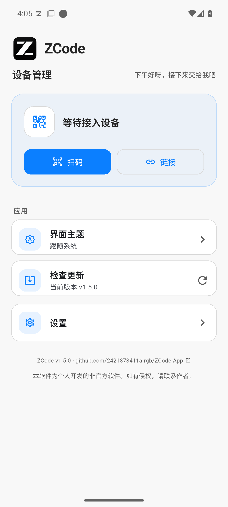
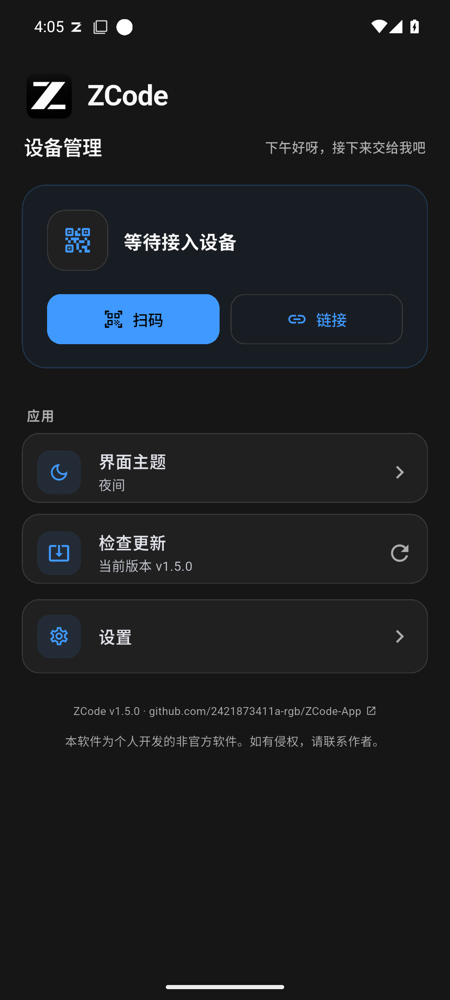
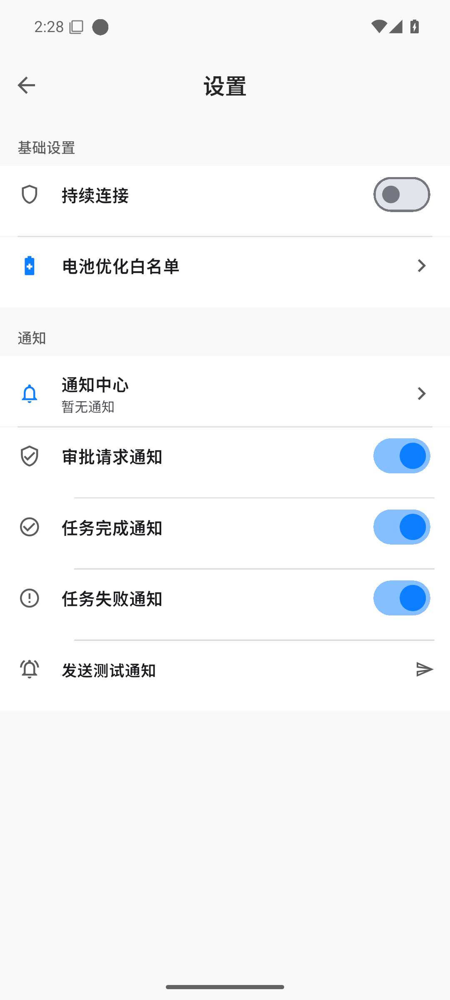

# ZCode

[中文](README.md) | **English**

> ZCode App is a personal, unofficial project and is not affiliated with Z.ai. ZCode and related names and trademarks belong to their respective owners.

> ## About this repository
>
> ZCode App is built on top of an upstream open-source project ([pjpv/zremote](https://github.com/pjpv/zremote)): it takes the original "scan-to-import + WebView session" app and reworks it into a ZCode mobile control client that follows a desktop-compatible mobile design language.
>
> - Roadmap and current status: [docs/ROADMAP.md](docs/ROADMAP.md)
> - Architecture and data link: [docs/ARCHITECTURE.md](docs/ARCHITECTURE.md)
> - ZCode remote/v4 protocol audit: [docs/ZCODE-PROTOCOL.md](docs/ZCODE-PROTOCOL.md)
> - The 14 desktop settings panels: [docs/ZCODE-PANELS.md](docs/ZCODE-PANELS.md)
> - Release and source-package checklist: [docs/RELEASE-CHECKLIST.md](docs/RELEASE-CHECKLIST.md)
> - WorkBuddy mobile reference: [docs/WORKBUDDY-REFERENCE.md](docs/WORKBUDDY-REFERENCE.md)
>
> Engineering status: test counts and `flutter analyze` results come from CI output; before release, run analysis, tests, and both platform builds with Flutter 3.47.

ZCode App 1.0.5 is a mobile companion app for ZCode desktop remote control. The desktop shows a QR code; scan it once with your phone to import the device and it stays usable long-term. Manage multiple machines in parallel and switch between them in a single UI.

<p align="center">
  
  
  
</p>

## Features

### Shell & navigation

- **Import via QR / paste** — scan the remote-control QR code shown by the desktop, or paste the control link, to add a device
- **Parallel multi-device sessions** — manage multiple devices and open each device's desktop-compatible session inside the bundled WebView
- **Five-tab shell** — Tasks / Workbench / Notifications (unread badge) / Devices / Settings

### Sessions

- **Tasks tab** — cross-device task card stream: sessionIndex merged, grouped by today / yesterday / earlier, status capsules plus approval / input count badges
- **Embedded WebView session page** — after selecting a device, the app loads ZCode desktop's remote-control page inside the bundled WebView, preserving the desktop page and interactions instead of replacing it with a native conversation screen

### Workbench (mobile-native desktop panels)

- **Nine-panel grid** — mirrors the desktop capability groups; 9 native data pages implemented: model / usage / subagents / skills / MCP / plugins / commands / hooks / memory, with no fake controls for unverified writes
- **Usage stats** — quota bars with three-tier coloring and reset time
- **Panel warm-up** — only explicitly allowlisted GET/HEAD panel requests are securely stored per device and replayed on the next load

### Notifications & background

- **Task event notifications** — approval requests, task completions and failures use an in-app notice while the app is open; both in-app and outside-app alerts use the system default notification tone
- **Notifications tab** — cross-device event timeline fed by the same event source as system pushes; opening it clears the unread count
- **Background alerts** — no persistent "ZCode running" notification is shown; the embedded WebView keeps listening while the app process remains alive, and only approval, completion, or failure events create an alert
- **In-app updates** — the app reads the latest GitHub Release asset URL, downloads the APK with an in-app progress surface, and opens Android's installer without navigating to a browser page
- **Session health indicator** — per-device connection state at a glance (loading / connected / error)
- **One-tap refresh & auto recovery** — reload a broken session manually; repeated failures fall back to automatic reload

### Security & appearance

- **Biometric gate** — lock the app with fingerprint / Face ID; verification required both to enable and to disable; lock screen carries the brand visual
- **Simplified Chinese UI** — the app is intentionally fixed to Simplified Chinese and has no language switcher
- **Settings page** — manages only launcher theme, connection, notifications, and updates; WebView settings stay inside the remote page
- **Dark console UI** — a dark interface friendly to low-light environments

## Download & Install

Build from source (see below) or grab a build from [Releases](https://github.com/2421873411a-rgb/ZCode-App/releases):

- **Android** — `ZCode.apk`, install directly after downloading; application ID: `com.zcode.app`
- **iOS** — `zcode-control-ios-unsigned.ipa`, an **unsigned build that cannot be installed directly**: sideload it with your own Apple ID via [AltStore](https://altstore.io), [Sideloadly](https://sideloadly.io), TrollStore, or similar (free-account signatures last 7 days and must be renewed)

## Building

Requirements:

- Flutter ≥ 3.47 (Dart ≥ 3.10)
- JDK 17 (Android builds)
- Xcode (iOS builds, macOS only)

```bash
flutter pub get

# Android
flutter build apk --release

# iOS (unsigned)
flutter build ios --release --no-codesign
```

## Usage

1. Open remote control in ZCode on the desktop and show the QR code
2. Scan it with the app (or paste the link)
3. The **Tasks** tab lists cross-device task cards; tap a device or task to open the embedded WebView session page
4. The **Workbench** tab shows native model / usage / subagents / skills / MCP / plugin / command / hook / memory data
5. When a task awaits approval or completes, a system notification arrives instantly; preferences live in the Settings page

## Repository layout

```
lib/
  ui/            pages: Tasks / Workbench / Notifications / Devices / Settings + WebView session entry
    panels/      native implementations of the workbench panels
  state/         state layer: session pool / session index / event feed / panel snapshot
  services/      data link: JS hooks / event observer / warm-up / notifications / device store
  l10n/          Chinese + English resources
docs/            roadmap / architecture / protocol audit / panel list / design reference
```

## Disclaimer

ZCode App is a personal, unofficial project and is not affiliated with Z.ai. ZCode and related names and trademarks belong to their respective owners.

All data comes from passively parsing the traffic of ZCode desktop's official remote/v4 bridge — no requests are forged and no authentication is bypassed.

## License

[MIT](LICENSE)
